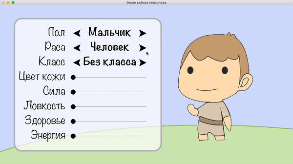

# demo-char-panel

Экран выбора персонажа для ролевой игры.



## Сборка и запуск

Клонируйте репозиторий:

```
git clone https://github.com/cmc-haskell-2017/demo-char-panel.git
cd demo-char-panel
```

Соберите проект при помощи [утилиты Stack](https://www.haskellstack.org):

```
stack setup
stack build
```

Собрать проект и запустить игру можно при помощи команды

```
stack build && stack exec demo-char-panel
```

## Документация

Для проекта доступна [Haddock-документация онлайн](https://cmc-haskell-2017.github.io/demo-char-panel/doc/index.html).
Просмотр документации рекомендуется, чтобы познакомится с общей структурой проекта,
а также чтобы не отвлекаться на детали реализации.

Локально собрать документацию можно при помощи команды

```
stack haddock
```

Собрать документацию без зависимостей (быстрее первый раз) можно, добавив опцию `--no-haddock-deps`:

```
stack haddock --no-haddock-deps
```

## Задание

В качестве задания к [лекции «Аппликативные функторы»](https://youtu.be/ckp60IxNH9s) требуется добавить недостающие поля в
[панель настроек персонажа](https://github.com/cmc-haskell-2017/demo-char-panel/blob/master/src/Game.hs#L57-L101),
используя базовые комбинаторы `slider` и `selector`, а также интерфейс аппликативного функтора.

